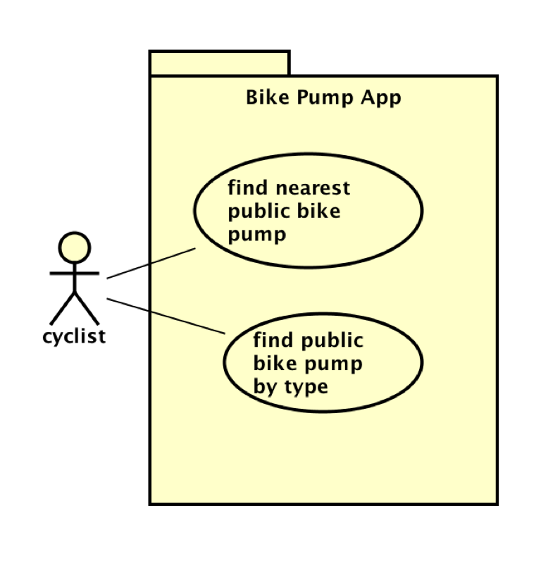

# Requirements

## User Needs

### User stories
As a user my job is to is to find the closest sports facility this is because it saves time and effort by avoiding travelling to a fully booked facility and having to look for another one.

As the council its is my responsibility to monitor all sports facilities on the app to gather data. The benefit of this is that it shows whether facilities are being used effectively or if additional ones are needed.

As a user my role is to also update the availability of sports facilities. The benefit of this is that it helps ensure the app remains accurate by showing which facilities are full and which are available.
### Actors
User 1: This is a person who needs to use a sports facility.

User 2: This is someone that is a member of the Bristol City Council that needs to use the app to look at usage data.

User 3: This is a staff member that uses the app to find out which sports facilities are in use or free and then updates the availability of those facilities.
### Use Cases
| USE-CASE ID        | USE-CASE NAME                                                                                             |
| ------------------ | --------------------------------------------------------------------------------------------------------- |
| **Description**    | The user needs to find an available sports facility without having to go from place to place wasting time |
| **Actors**         | people who use the sports facility                                                                        |
| **Assumptions**    | people will use the app to see what facilities are available                                              |
| **Steps**          | people will check the app to see which facilities are available and free to use                           |
| **Variations**     | any changes in the steps of a use                                                                         |
| **Non-functional** | A list of requirements that the use case must meet that are not functional.                               |

| UC2                | USE-CASE NAME                                                                                                                                           |
| ------------------ | ------------------------------------------------------------------------------------------------------------------------------------------------------- |
| **Description**    | The goal for the staff member is to ensure that sports facilities are ready and available for users to access.                                          |
| **Actors**         | staff member at the facility                                                                                                                            |
| **Assumptions**    | uses the app to find out which sports facilities are in use or not.                                                                                     |
| **Steps**          | Find out which facilities are not available or are being used, make them available again if necessary, and let the public know when they are available. |
| **Variations**     | Any differences in the steps of a use case                                                                                                              |
| **Non-functional** | A list of requirements that the use case must meet that are not functional.                                                                             |
| **Issues**         | A list of problems that still need to be fixed.                                                                                                         |

TODO: Your Use-Case diagram should include all use-cases.

## Software Requirements Specification
### Functional requirements
FR1: The map should clearly show all of the sports facilities.

FR2: The system should need to know where the user is.

FR3: The system should show whether the sports facilities that the user is looking at are free.

FR4: The system should show how much it costs to use each sports facility.

### Non-Functional Requirements
NFR1: The app should respond quickly to user actions (performance efficiency).

NFR2: The app should clearly display all sports facilities with appropriately sized markers (usability).

NFR3: The app should be usable on Chrome internet browsers (compatibility).

NFR4: The app should provide a suitable default location if the user’s location is not available (reliability).

NFR5: The app should be regularly updated to ensure all listed sports facilities are accurate and in working condition (functional suitability).

NFR6: The app should handle user requests with minimal delay (performance efficiency).

NFR7: The app should be accessible on mobile devices as well as other platforms (portability).

NFR8: The app should support user safety by allowing incidents to be reported easily, including time and location details (security).

NFR9: The app should provide frequent updates so users can view current facility availability when they open the app (maintainability).
